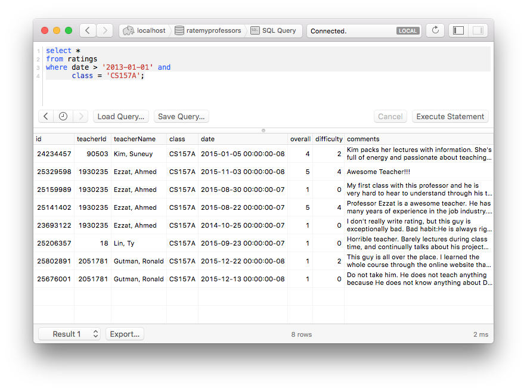

# Should You Take?

## About

Course listings at colleges and universities show you who is currently teaching
a class for the current term, but it can be difficult to see who taught the
course in the recent past. Additionally, looking up all the professors on
[www.ratemyprofessors.com](www.ratemyprofessors.com) can sometimes aid in
decisions, but is time consuming.  This program aims to make both tasks easier.



## Usage

### Preparation

```
$ npm install
$ mkdir departments
```

On www.ratemyprofessors.com, go to your school's index page and click on "VIEW
ALL PROFESSORS".

Select a department.

Click on "LOAD MORE" at the bottom until there are no more remaining.

In your browser, inspect the HTML of the professor list and copy the `<ul>`
they are in. Paste it to `departments/<name>.html`.

Convert the HTML file to JSON with:

```
$ ./professors.js
```

### Download the ratings

Run one of:

```
$ npm install sqlite
$ npm install mysql
$ npm install pg
```

If running MySQL or Postgres, start your database server and create a database.

Inspect the `HEADERS` and `WAIT` constants at the top of `ratings.js` and make
sure they are to your liking. `HEADERS` will be sent with every request to
www.ratemyprofessors.com, while `WAIT` is a number of milliseconds to wait
between requests. The download of ratings will be hundreds of requests.

Then:

```
$ DB=postgres://localhost/ratemyprofessors ./ratings.js
```

where ratemyprofessors is the name of the database you created.

This will systematically start downloading the ratings for every professor
found in your `departments/` directory.

### Query

Query your database to your liking!

You're set until next term. 🍰

## Legal

You should read
[RateMyProfessors.com Terms of Service § 4](http://www.ratemyprofessors.com/TermsOfUse_us.jsp#section4)
before using.

## Development

Feel free to fork and/or send pull requests!
